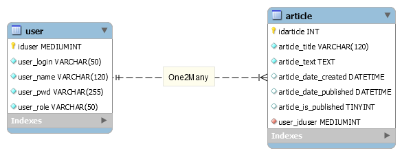

# MVC-2025-Create-Read

## Configuration

Importation du fichier `data/mvc2025createread-with-datas.sql` dans votre base de données MariaDB.

## Fichiers de configuration

Dupliquez le fichier `config-dev.php` et renommez-le-en `config-prod.php`. Il se trouve actuellement dans le `.gitignore`, pour des raisons de sécurité.

## Le dossier public 

Le dossier public est la racine de notre site.

## Identifiants

### Pour se connecter à l'administration

Il faudra se connecter avec un des utilisateurs présents dans la base de données.

### Utilisateurs dans la DB

- `admin` | `lulu25` | `Pitz Michaël` | `admin`
- `modo` | `lala36` | `Sandron Pierre` | `modo`
- `user1` | `use123r` | `Sall Magib` | `redac`

### Notre base de donnée `mvc2025createread`

## Exercice

Il faut créer une administration, protégée par un login et mot de passe (voir la table `user`) qui permet de mettre des articles.

Les articles (voir la table `article`) seront affichés par ordre de publication `article_date_published` descendant sur la page d'accueil.
- Ils doivent être publiés `article_is_published` => 1 via une checkbox à cocher sur le formulaire
- La date de publication `article_date_published` doit être indiquée via ce même formulaire
- Seul l'utilisateur connecté `$_SESSION['iduser']` peut poster l'article

